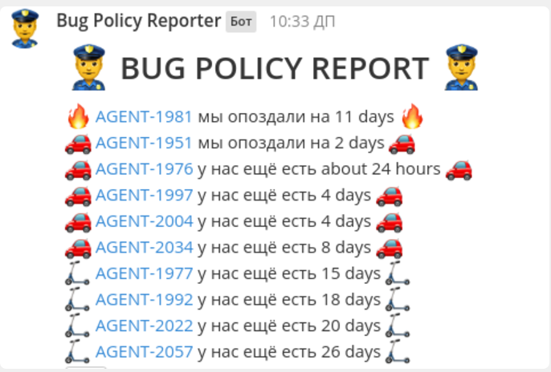

# Bug Policy Mattermost Notifier

Уведомлятор о соблюдении баг полиси

Выглядит примерно так:

## Как использовать

* git clone
* `mv config.sample.js config.js`
* Напиши в `config.js` свои
    * `jiraHost` - домен твоей jira
    * `jiraUsername` - юзернейм пользователя, под которым нотифаер будет логинится
    * `jiraPassword` - пароль пользователя, под которым нотифаер будет логинится
    * `jiraProjects` - проекты, для которых нужно искать баги. Используется в JQL запросе в параметре `project`
    * `mattermostWebhookPath` - url mattermost webhook, можно узнать в интерфейсе маттермост
    * `mattermostChannel` - канал, в который нужно писать сообщение
* используй `npm start` и получай отчёт!